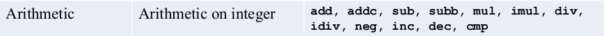
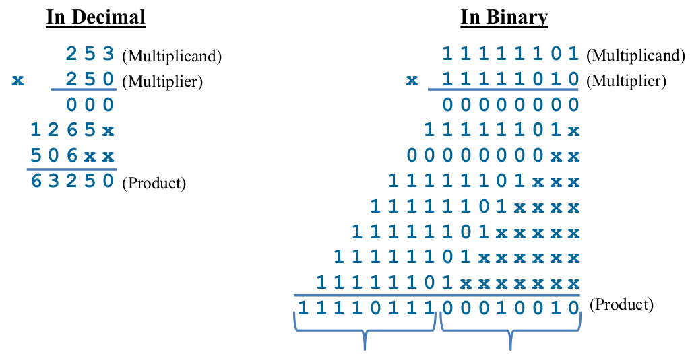
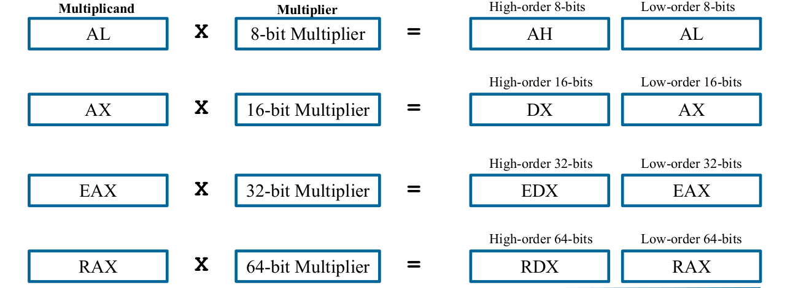
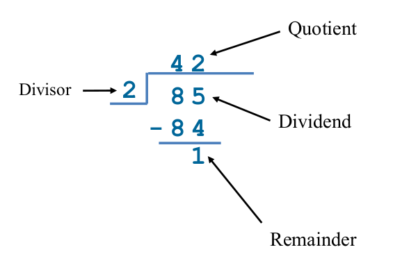
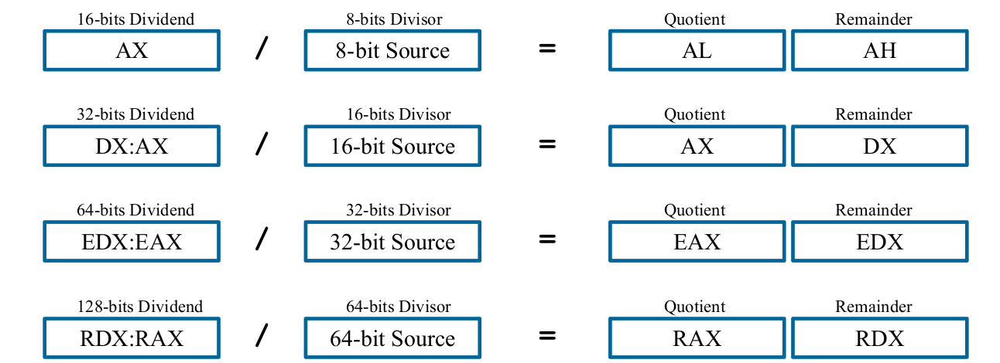

# Arithmetic Instructions

instructions operate on registers or memory locations and can perform various arithmetic operations, such as addition, subtraction, multiplication, and division.



- **Destination operand can be a register / memory**
- **Source operand can be an immediate value / register / memory**
- **Flags Affected ->** AF, CF, OF, PF, SF, ZF

<br>

## Contents

- Arithmetic
  - **ADD** (Addition)
  - **ADC** (Addition with carry)
  - **SUB** (Subtraction)
  - **SBB** (Subtraction with borrow)
  - **INC** (Increment)
  - **DEC** (Decrement)
  - **NEG** (Negation)
  - **CMP** (Compare)
- Miscellaneous
  - **CLC** 
  - **STC**
  - **CMC**
- Multiplication
  - **MUL** (Unsigned Multplication)
  - **IMUL** (Signed Mul...)
  - **IMUL** (with 2 operands)
  - **IMUL** (with 3 operands)
- Division
  - **DIV** (Unsigned Division)
  - **IDIV** (Signed Div...)
- Sign Extension Instructions
  - **CBW**
  - **CWD**
  - **CDQ**

<br>

### ADD (Addition)
---

Destination = Destination + Source

```
    ADD dest, source
```

<br>

### ADC (Add with Carry)
---

Destination = Destination + **(Source + CF)**

```
    ADC dest, source
```
<br>

### SUB (Subtraction) 
---

Destination = Destination - Source

```
    SUB dest, source
```
<br>

### SBB (Subtract with Borrow)
---

Destination = Destination - **(Source + CF)**

```
    SBB dest, source
```

<br>

### INC (Increment)
---

Destination = Destination + 1

```
    INC dest, source
```

- CF is not affected.

<br>

### DEC (Decrement)
---

Destination = Destination - 1

```
    DEC dest
```

- CF is not affected.

<br>

### NEG (Negation) => (Two's complement)
---

Destination = -Destination

```
    NEG dest
```

- CF is always 1, unless result is zero.

<br>

### CMP (Compare)
---

The CMP instruction subtracts the value of Operand2 from the value in Operand1 . This is the same as a SUBS instruction, except that the result is discarded. The CMN instruction adds the value of Operand2 to the value in Operand1. This is the same as an ADDS instruction, except that the result is discarded.

```
    CMP operand1, operand2
```

- **sets the ZF if result is zero**.
- Operand1 can be register or memory.
- Operand2 can be immediate value, register and memory.
- Compares the values, setting the flags according to the result.
- **Flags Affected** AF, CF, OF, PF, SF, ZF

<br>

## Miscellaneous


### CLC
---

```
    CLC
```

- Clears the CF only.

<br>

### STC
---

```
    STC
```

- Sets the CF only.

<br>

### CMC Compliment
---

```
    CMC
```

- Compliment's the CF only.

<br>

## Multiplication



| Operand   |  SizeMultiplier |  (Operand)Multiplicand | (Implicit)Destination    |
|:---------:|:---------------:|:----------------------:|:------------------------:|
| Byte      |    r/m8         |        AL              |     AX = AL * r/m8       |
| Word      |    r/m16        |        AX              |  DX:AX = AX * r/m16      |
| Doubleword|    r/m32        |        EAX             |  EDX:EAX = EAX * r/m32   |
| Quadword  |    r/m64        |        RAX             |  RDX:RAX = RAX * r/m64   |

<br>

- CF and OF are both set if the product extends into the higher register AH, DX, or EDX respectively.


<br>

### Unsigned Multiplication
---

```
    mov al, 7h    ;multiplicand
    mov bl, 3h    ;multiplier
    MUL bl        ;AX have the product & CF and OF affected.
```

<br>

### Signed Multiplication
---

```
    mov al, -4d  ;multiplicand
    mov bl,100d  ;multiplier
    IMUL bl 
```

#### IMUL with 2 operands
---

```
    mov r8, 3456789d
    mov r9, -537d
    IMUL r9, r8
```

- Destination operand must be a register.
- Source operand can be immediate value / register / memory.

<br>

#### IMUL with 3 operands
---

```
    mov r8, 38475342d
    IMUL r9, r8, -34567d
```

- Destination operand must be a register.
- Source 1 Operand can be register / memory.
- Source 2 Opernad can be immediate value only

<br>

## Division



| Operand Size          |  Dividend     |  Divisor | Quotient    | Remainder | Maximum Quotient  |
|:---------------------:|:-------------:|:--------:|:-----------:|:---------:|:-----------------:|
| Word/Byte             |    AX         |   r/m8   |  AL         |  AX       |  2^8 - 1          |
| Doubleword/Word       |    DX:AX      |   r/m16  |  AX         |  DX       |  2^16 - 1         |
| Quadword/Doubleword   |    EDX:EAX    |   r/m32  |  EAX        |  EDX      |  2^32 - 1         |
| 128bit/64bit          |    RDX:RAX    |   r/m64  |  RAX        |  RDX      |  2^64 - 1         |

<br>

- Status Flags are undefined for division instruction


<br>

### Unsigned Division
---

```
    mov ax, 85 ; dividend
    mov bl, 2  ; divisor
    DIV bl
```

<br>

### Signed Division
---

```
    mov ax, 0007h ; dividend
    mov bl, -2    ; divisor
    IDIV bl
```

<br>

## Sign Extension (Conversions)


<br>

### CBW
--- 

- Convert byte to word instruction extends the sign bit of AL
into the AH register.

```
    mov al, d0h ; -8
    CBW         ; AH:AL = FF D0h
```

<br>


###  CWD
---

- Convert word to double word instruction extends the sign bit
of AX into the DX register

```
    mov ax, FFD0h   ; -8
    CWD             ; DX:AX = FFFF FFD0h
```

<br>

### CDQ
---

- Convert double word to quad word instruction extends the sign
bit of EAX into the EDX register.

```
    mov eax, FFFFFFD0h   ; -8
    CDQ                  ; EDX:EAX = FFFFFFFF FFFFFFD0h
```
<br>