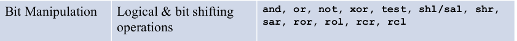
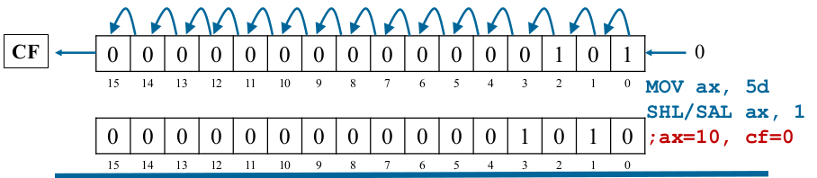
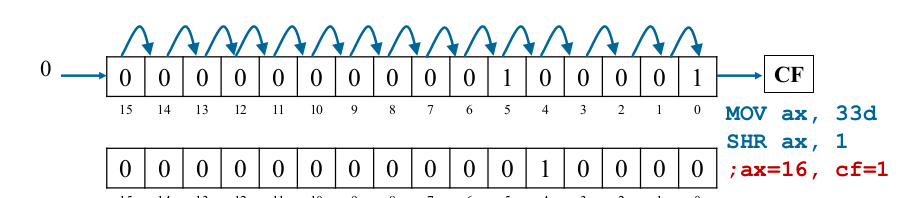
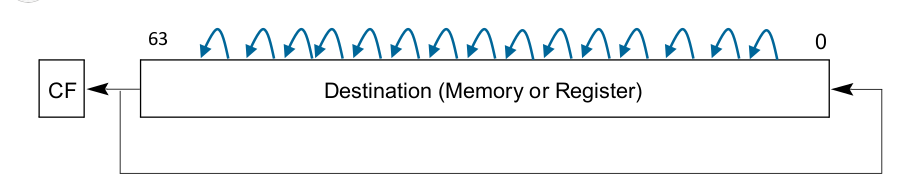
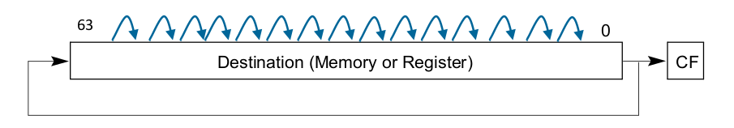
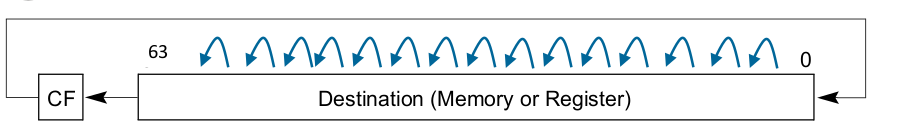
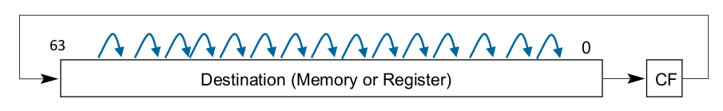

## Bit Shift Instrcutions

A brief description of bit shift instructions and the rules.



In these Instructions

- destination can be **register** or **memory**
- **<=63** bits can be shited or can be immediate value or CL.

---

### compilation

- nasm -felf64 filename.nasm
- ld filename.o -o filename
- ./filename

---

### Logical shift Left (SHL)

SHL operation pushes a zero into least significant bit (LSB) position and the most significant bit (MSB) is shifted to Carry Flag (CF).



```bash
    SHL dest, count
```
- **Usage** : used to mutiply signed/unsigned destination contents with 2^n where n is the number of bits shifted.
- CF contains the MSB shifted out of the destination operand.
- **source file** shl&sal.nasm 


---

### Shift Arithmatic Left (SAL) 


```bash
    SAL dest, count
```

- same as **SHL instruction**.
  
- **source file** shl&sal.nasm 

---

### Logical shift Right (SHR) 

SHR operation pushes a zero into MSB position 
and the LSB is shifted to Carry Flag (CF).




```bash
    SHR dest, count
```

- shifts the bits in the destination to the **right** by count bits.
- **Usage** : used to divide unsigned destination contents with 2^n where n is the number of bits shifted.
- CF contains LSB shifted out of destination operand.
- **source file** shr.nasm 

---

### Shift Arithmatic Right (SAR)

In SAR the signed bit is pushed in the MSB position and
the LSB is shifted to the CF.


```bash
    SAR dest, count
```
- **Usage** : used to divide signed/unsigned destination contents with 2^n where n is the number of bits shifted.
- CF contains the LSB shifted out of the destination operand.
- **source file** sar.nasm.

---

### Rotate Left (ROL) Instruction

The MSB is placed in the CF and also pushed in the LSB.
Remaining bits moved towards the left.



```bash
    ROL dest, count
```

- CF contains MSB out of the destination operand.
- used for bit shifts across mutiple words.

---

### Rotate Right (ROR) Instruction

The LSB is placed in the CF and also pushed in place
of MSB and remaining bits moved one position right.



```bash
    ROR dest, count
```

- CF contains LSB out of the destination operand.
- used for bit shifts across mutiple words.

---

### Rotate Carry Left (RCL) Instruction

In this MSB is removed and placed in the CF flag and 
the value of CF is shifted in place of LSB and the 
remaining bits are moved one position left.



```bash
    RCL dest, count
```

- CF contains MSB out of the destination operand.
- used for bit shifts across mutiple words.

---

### Rotate Carry Right (RCR) Instruction

In this operation LSB is placed in the CF flag and 
previous value of CF is shifted in position of MSB.



```bash
    RCR dest, count
```

- CF contains LSB out of the destination operand.
- used for bit shifts across mutiple words.

---