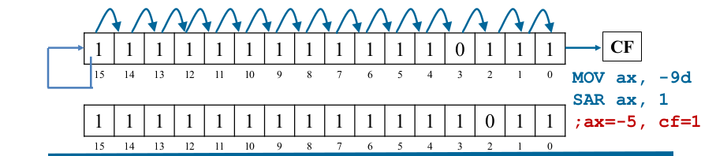

## Bit Shift Instrcutions

A brief description of bit shift instructions and the rules 

---

### compilation

- nasm -felf64 filename.nasm
- ld filename.o -o filename
- ./filename

---

### Logical shift Left (SHL)

SHL operation pushes a zero into least significant bit (LSB) position and the most significant bit (MSB) is shifted to Carry Flag (CF).


```bash
    SHL dest, count
```

- destination can be **register** or **memory**
- **<=63** bits can be shited or can be immediate value or CL.
- **Usage** : used to mutiply signed/unsigned destination contents with 2^n where n is the number of bits shifted.
- CF contains the MSB shifted out of the destination operand.
- **source file** shl&sal.nasm 


---

### Shift Arithmatic Left (SAL) 


```bash
    SAL dest, count
```

- same as **SHL instruction**.
  
- **source file** shl&sal.nasm 

---

### Logical shift Right (SHR) 

SHR operation pushes a zero into MSB position 
and the LSB is shifted to Carry Flag (CF).


```bash
    SHR dest, count
```

- shifts the bits in the destination to the **right** by count bits.
- destination can be **register** or **memory**.
- **<=63** bits can be shited or can be immediate value or CL.
- **Usage** : used to divide unsigned destination contents with 2^n where n is the number of bits shifted.
- CF contains LSB shifted out of destination operand.

---

### Shift Arithmatic Right (SAR)

In SAR the signed bit is pushed in the MSB position and
the LSB is shifted to the CF.



```bash
    SAR dest, count
```

- destination can be **register** or **memory**
- **<=63** bits can be shited or can be immediate value or CL.
- **Usage** : used to divide signed/unsigned destination contents with 2^n where n is the number of bits shifted.
- CF contains the LSB shifted out of the destination operand.