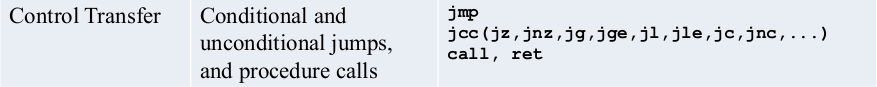
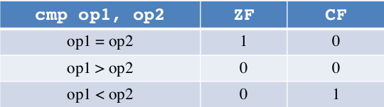
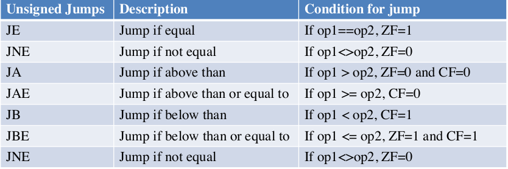
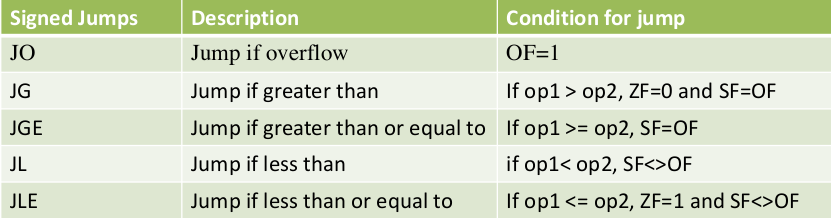

#  Control Instructions



<br>

## Contents

- Control of Flow
  - Control of Flow of Program Execution
  - Types
- Unconditional JUMP Instruction
  - Types of unconditional jump
    - Short Jump
    - Near Jump
    - Far Jump
    - Task Switch
- CMP Instruction
- Conditional JUMP Instructions
  - Types
  - Unsigned Instructions
  - Signed Instructions
- Codes
  - Example 0x1
    - High level Language Code
    - Assembly code
  - Example 0x2
    - High level Language Code
    - Assembly code
  - Example 0x3
    - High level Language Code
    - Assembly code
  - Example 0x4
    - High level Language Code
    - Assembly code
  - Example 0x5
    - High level Language Code
    - Assembly code
- Repetition Structure
  - For Loop
  - While Loop
  - Do While loop


## Control of Flow

<br>

### Control of Flow of Program Execution
---

- The execution of every program starts from the
label named _start, that define the initial
program entry point. All code runs from top to
bottom by default and the direction a program
flows is called program flow.

- The instruction pointer (RIP) register holds the
address of the next instruction to be executed.
After each instruction it is incremented by the
instruction size (suppose 1 byte), thus making the control flow naturally flow from top to bottom.

- X86-64 control instructions are used to alter the flow of execution of a program based on some
event/calculation/comparison

### Types

- Procedure Call     (**CALL** \<label> & **RET**)
- Conditional jump   (**JCC**  \<label>)
- Unconditional jump (**JMP**  \<label>)

<br>

### Unconditional JUMP Instruction
---

is a type of control transfer instruction that allows the program execution to transfer to a different location in the code unconditionally.

Destination operand is normally a
**label**, i.e., a **memory address pointing to some instruction**. But can also be a **register** or **immediate value**.

```
    JMP dest
```

#### Types of unconditional jump
---

- **Short jump**
  - A jump where the jump range is
limited to -128 to +127 from the current RIP value.(CS do not change)

- **Near jump**
  - A jump within the current code
segment.

- **Far jump**
  - Far jump to any address in the memory address space.

- **Task switch**
  - A jump to an instruction located in
different task

```
_start:

    ; some instrctions

    JMP _end

    ; some instructions

_end:
    mov rax, 60
    mov rdi, 0
    syscall
```

<br>

### CMP Instruction
---

The cmp instruction subtracts the second operand from first
operand, no operand is modified, however the flags (AF, CF, OF,
PF, SF, ZF) are set according to the result



- First operand can be a register or memory, while the second
operand can be an immediate value as well

```
    mov al, 5d
    cmp al, 5d
    ;ZF=PF=1, CF=OF=SF=AF=0
```

```
    mov al, 5d
    cmp al, 6d
    ;CF=PF=AF=SF=1, ZF=OF=0
```

```
    mov al, 6d
    cmp al, 5d
    ;ZF=CF=OF=PF=SF=AF=0
```

<br>

### Conditional JUMP Instructions
---

Most of assembly programmers use the cmp instruction before using the
conditional jump.

```
    cmp op1, op2
    Jcc <label>
```

- If the condition code is **true**, the next instruction to be executed is the
one at the destination (which is the address of the instruction being
jumped to, can be a label, a register or immediate value).
- If the condition code is **false**, the instruction following the Jcc
instruction gets executed.

- To implement a conditional jump, the **CPU** looks at one or more status
flags **(CF, ZF, OF, PF, and SF)**, that are set by **last** instruction executed by
the processor

#### Types 

- Unsigned Jumps  (Operate on ZF and CF)
- Signed Jumps    (Operate on ZF, SF and OF)

<br>

### Unsigned Jumps
---

Conditional unsigned jumps are used when the previous arithmetic operation's result is treated as an unsigned integer. In an unsigned integer representation, all bits contribute to the value, and there is no dedicated sign bit.



<br>

### Signed Jumps
---

Conditional signed jumps are used when the previous arithmetic operation's result is treated as a signed integer. In a signed integer representation, the leftmost bit (most significant bit) represents the sign, where 0 indicates a positive number, and 1 indicates a negative number.



<br>

## Codes

<br>

### Example 0x1
---

#### High level Language code

```
    if (AX < 0) then
    print(“Negative Number!”);
    end if
```

#### Assembly code

```
SECTION .data
    msg db "Negative Number!",0xa
    len_msg equ $ - msg

SECTION .text
    global _start
_start:

    mov ax, -5d
    cmp ax, 0
    ;SF=1, OF=0
    jge _end
    mov rax, 1
    mov rdi, 1
    mov rsi, msg
    mov rdx, len_msg
    syscall

_end:

    mov rax, 60
    mov rdi, 0
    syscall
```

<br>

### Example 0x2
---

#### High level language code

```
    if (AX < 0) then
    print (“Negative Number!”);
    else
    print(“Positive Number!”);
    end if
```

#### Assembly code

```
SECTION .data
    msg1 db "Negative Number!",0xa
    len_msg1 equ $ - msg1
    msg2 db ”Positive Number!",0xa
    len_msg2 equ $ - msg2

SECTION .text
    global _start
_start:

    mov ax, 5d
    cmp ax, 0
    jge _positive
    mov rax, 1
    mov rdi, 1
    mov rsi, msg1
    mov rdx, len_msg1
    syscall
    jmp _end

_positive:
    mov rax, 1
    mov rdi, 1
    mov rsi, msg2
    mov rdx, len_msg2
    syscall

_end:
    mov rax, 60
    mov rdi, 0
    syscall
```

<br>

### Example 0x3
---

#### High level language code

```
    if (AX == BX) then
    print(“Equal”);
    else if (AX > BX) then
    print(“AX > BX”);
    else
    print(“BX > AX”);
    end if
```

#### Assembly language

```
SECTION .data
    msg1 db "AX == BX", 0xa
    len_msg1 equ $ - msg1
    msg2 db "AX > BX", 0xa
    len_msg2 equ $ - msg2
    msg3 db "BX > AX", 0xa
    len_msg3 equ $ - msg3

SECTION .text
    global _start
_start:

    mov ax, 5d
    mov bx, -25d

    cmp ax, bx
    je _equal

    cmp ax, bx
    jg _axbigger
    ;print (BX > AX”)
    jmp _end

_axbigger:
    ;print (AX > BX”)
    jmp _end

_equal:
    ;print (AX == BX”)

_end:
    mov rax, 60
    mov rdi, 0
    syscall
```
<br>

### Example 0x4
---

#### High Level Code

```
    if (AL == ‘Y’ OR AL == ‘y’) then
    print(“YES”);
    end if
```

#### Assembly language

```
SECTION .data
    msg: db ”YES",0xa
    len_msg: equ $ - msg

SECTION .text
    global _start
_start:

    mov al, ‘P’
    cmp al, ‘Y’
    je _true
    cmp al, ‘y’
    je _true
    jmp _end

_true:
    mov rax, 1
    mov rdi, 1
    mov rsi, msg
    mov rdx, len_msg
    syscall

_end:
    mov rax, 60
    mov rdi, 0
    syscall
```

<br>

### Example 0x5
---

#### High Level Code

```
    if (AL >= ‘A’ && AL <= ‘Z’) then
    print(“Upper Case Alphabet”);
    end if
```

#### Assembly language

```
SECTION .data
    msg: db ”Upper Case Alphabet",0xa
    len_msg: equ $ - msg

SECTION .text
    global _start
_start:

    mov al, ‘P’
    cmp al, ‘A’
    jb _end
    cmp al, ‘Z’
    ja _end
    mov rax, 1
    mov rdi, 1
    mov rsi, msg
    mov rdx, len_msg
    syscall

_end:
    mov rax, 60
    mov rdi, 0
    syscall
```

<br>