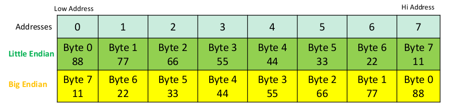

# Datatypes 

- Data Types & Special Tokens in NASM
  - For Initialized Data
  - For Un-initialized Data
- Endianness
  - Little Endian Machines
  - Big Endian Machines

 

### Initialized Datatypes
---

- 8-bit DB **(Define Byte)** Represented by a 1 byte.
- 16-bit DW **(Define Word)** Represented by 2 bytes.
- 32-bit DD **(Define Double Word)** Represented by 4 bytes.
- 64-bit DQ **(Define Quad Word)** Represented by 8 bytes.
- 80-bit DT **(Define Ten Bytes)** Represented by 10 bytes.
- 128-bit DO **(IEEE 754 Quad)** Represented by 25 bytes.
  
 

### Uninialized Datatypes
---

- RESB \<count> Reserve bytes
- RESW \<count> Reserve words
- RESD \<count> Reserve double words
- RESQ \<count> Reserve quad words
  
 

### Special Tokens

---

- **$** evaluates current line.
- **$$** evaluates beginning of current section.
-  **equ** used to define constant.
-  **times** to repeat data and instructions.

 

### Endianness
---

Endianness is a term used to describe the order in which multi-byte data (such as integers) is stored in computer memory.

#### Big Endian

- In big endian, the most significant byte of a multi-byte data item is stored at the lowest memory address (the first byte).
- The MSB is stored at smallest position.
- MIPS, MC6800

#### Little Endian

- In little endian, the least significant byte of a multi-byte data item is stored at the lowest memory address (the first byte).
- The LSB is stored at the smallest position.
- x86, ARM

#### Example 

- Let us store a 8 byte number 0x1122334455667788 in memory

