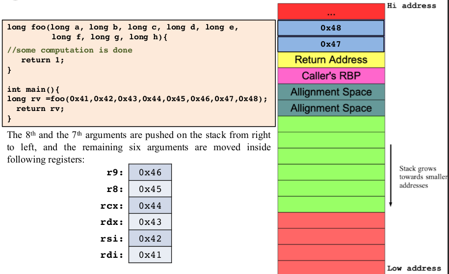
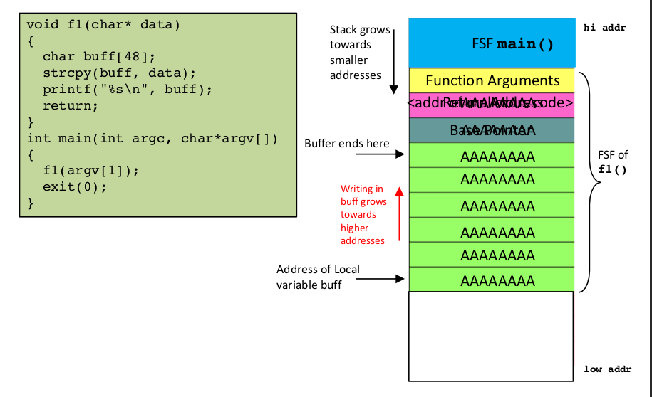

# C Function Calling & The Run-Time Stack

## Contents

- The Run-Time Stack
- Contents of Function Stack Frame
- FSF (Function Stack Frame)
  - Procedure Prolog
  - Procedure epilog
- FSF on x86-64 Running Linux OS (picture)
- Stack Based Buffer Overflow (picture)

<br>

### The Run-Time Stack
---

A **Function Stack Frame** (FSF) or **Activation Record** is a stack data structure that
is used to store all **data** on the stack associated with **one** function. The code for the
**maintenance** of the call stack is generated by high level language **compilers**.

- The Function Stack Frame **(FSF)** of a function is created on
the stack when a function is **called** and **removed** from the stack
when a function returns.


<br>

### Contents of Function Stack Frame
---

On x86-64 running Linux Operating System, the
contents of FSF for a function contains

- Function arguments (if greater than 6)
- Return address of caller
- The current contents of rbp register
- Space for function local variables

<br>

### FSF (Function Stack Frame)
---

On x86-64 running Linux Operating System, the FSF for
a function is created by the following sequential steps

- The function **arguments** (>6) are pushed on the stack
by the **caller**.
- The contents of rip (return address) is also pushed
on the stack.

#### Procedure Prolog
---

When control is shifted to the first instruction of the
callee, which performs a **procedure prolog**.

```
    PUSH rbp
    MOV rbp, rsp
    SUB rsp, 0X20
```

<br>

#### Procedure epilog
---

When callee is done with its execution, it first cleans up
the **FSF** and then calls the **return** statement to transfer
control to its caller by performing a **procedure epilog**

```
    MOV rsp, rdp   ; LEAVE
    pop rbp        ; LEAVE
    pop rip        ; RET
```

<br>

### FSF on x86-64 Running Linux OS
---



### Stack Based Buffer Overflow
---


