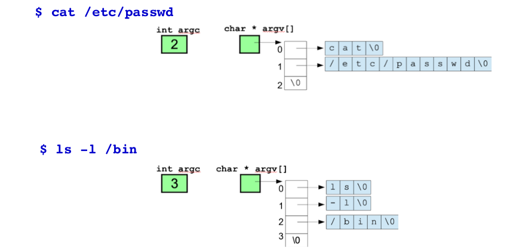
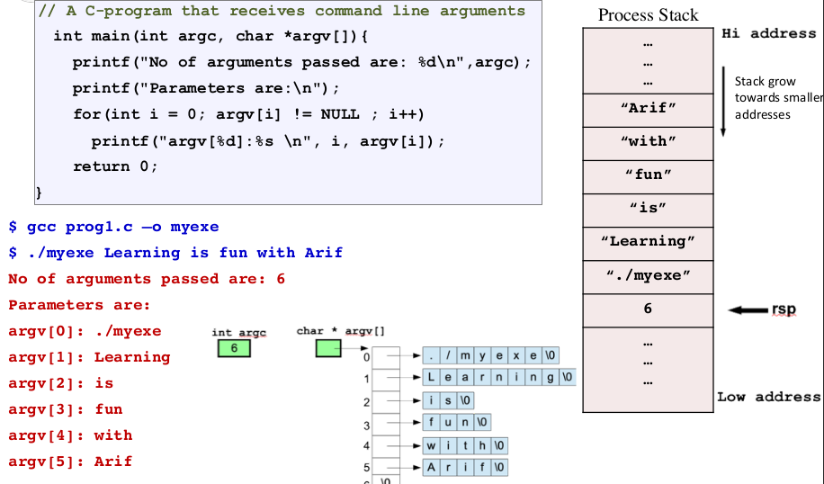

# Getting Input From user via read and cmdline arguments


### Getting Input
---

Writing a computer program in any programming language, a programmer may
need to get **input** from user via keyboard (**stdin**) and later displays the result on
screen (**stdout**).

- Three different ways to get input from user via keyboard in x86-64 assembly language programming.
  - By making a system call during the program execution.
  - By making a library call during the program execution.
  - Using Command Line Arguments before the program executes.

- The input given by the user must be properly **tested**/**validated** to ensure that it is as
per the expectation of the program. **Malicious** input can include code, scripts and
commands, which if not validated correctly can be used to **exploit** **vulnerabilities**
like **Buffer Overflow, XSS, SQL injection** etc.

<br>

### The read System Call
---

- Depending on your **architecture**, you need to place the system call ID
in an **rax** register.
- Next step is to place the system call arguments inside registers **rdi, rsi, rdx, rcx, r8, r9**. In case of more than **six arguments** push them on stack.
- After the system call **returns**, the return value can be found inside **rax** register.

<br>

### Input using C library calls
---

- Compilation

```
    nasm inputwithlibcall.nasm -felf64
    gcc --static inputwithlibcall.o -o myexe
    ./myexe
```

<br>

### List of available System Calls
---

- On my Intel CPU, running **Ubuntu Linux 6.2 (kernal)**, there are a total of **450** system calls, whose IDs can be seen from the file => **/usr/include/x86_64-linux-gnu/asm/unistd_64.h**.

- int read(int fd, void* buff, int count);

##### Some important System calls.

| System calls |  ID   |
| :----------: | :---: |
|    read()    |   0   |
|   write()    |   1   |
|    open()    |   2   |
|   close()    |   3   |
|   getpid()   |  39   |
|    fork()    |  47   |
|  shutdown()  |  48   |
|    exit()    |  60   |

<br>

### Command Line Arguments
---

Command line arguments allow a user to input data into a **program** without the
program requiring a **user** **interface**.



##### Arguments



<br>

