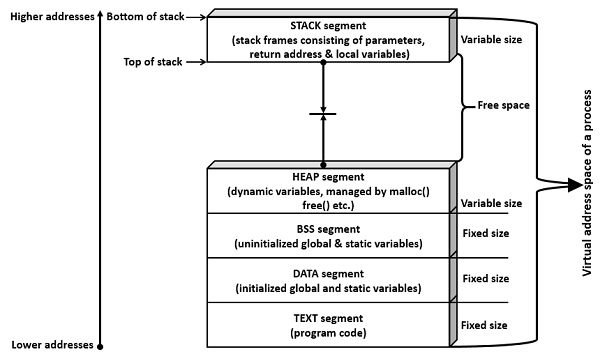

# Data Transfer and Process Stack

- MOV is one of the fundamental instructions in assembly language, and it is used to copy data from a source operand to a destination operand.

<br>

### MOV
---

```
    MOV destination, source
```

- MOV instruction does not change the flags register
- Both the operands of MOV instruction should be of same size and the value of
source operand remains unchanged
- If both operands are same registers, it acts a a NOP instruction, no effect on register value.
  -  A NOP instruction does not perform any operation and serves as a way to insert delays, pad instructions, or align code for performance optimization or other purposes.

<br>

### Operations of MOV
---

- **Immediate data to register**
- **Register to Register**
- **Register to Memory**
- **Memory to Register**
- **Immediate data to memory**

<br>

- **(Memory to Memory)** is not allowed
  - Note that while the instruction writes a word to the destination, it reads the next word from the source in the same clock cycle. You can have a cache bank conflict if bit 2-4 are the same in these two addresses on P2 and P3.

### concept

```
SECTION .data
    var db 0x42

SECTION .text
    global _start
_start:

    mov rax, var         ; var is the address
    mov al, byte [var]   ; [var] is the value of var which is 0x42
```

<br>

### LEA (Load Effective Address) Instruction
---

instruction is used to load address of a variable into a
register and later manipulate the data indirectly with the register as a pointer.

```
    lea rax, var
```

- The lea instruction has no effect on the rflags register.
- **lea register memory**


<br>

### xchg Instruction
---

The xchg instruction is used to exchange or swap the contents of two registers
or the contents of a a register and a memory location

```
    xchg rax, rbx
```

- High level languages like C/C++ make extensive use of
the stack like temporary storing the arguments passed to
a function, local variables and so on.
- **xchg register, register**
- **xchg register, memory**

<br>

### Logical Process Address Space

- A PUSH operation that stores data on the
stack (push reg/immediate)
- A POP operation that removes data from the
stack (pop reg)

